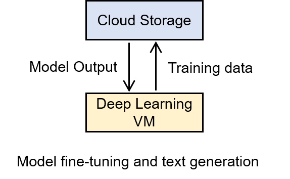
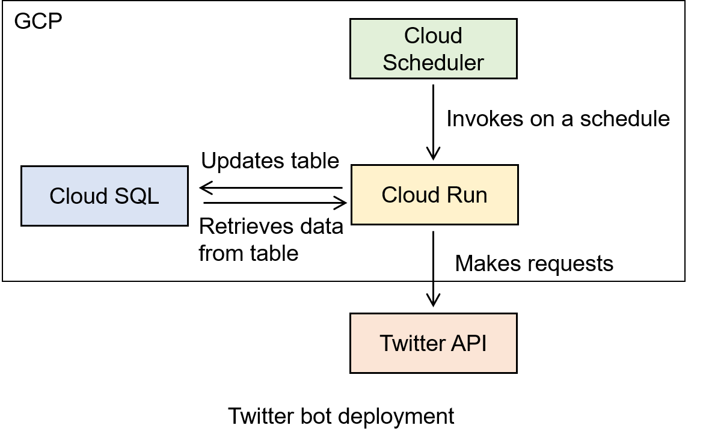
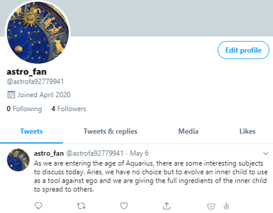

# Twitter Bot with Text Generated from Fine-Tuned GPT-2 Model

## Introduction

Motivated by my desire to learn about cloud tools, my interest in seeing how well language models work in practice and my curiosity about astrology :crystal_ball:, the goal of this project is to build a bot that send out astrology-themed tweets at scheduled times, with the content generated from the GPT-2 language model. The project is hosted on Google Cloud Platform (GCP). It leverages [@minimaxir's](https://github.com/minimaxir) helpful [guide on running Twitter bots hosted on GCP](https://github.com/minimaxir/twitter-cloud-run) and the amazing `transformers` package from HuggingFace for working with the GPT-2 model.

### Overview of Steps Taken

Part 1: coming up with new tweets
  1. Scrape data for purposes of model fine-tuning
  2. Fine-tune model on a server with GPU
  3. Generate astrology-themed tweets



Part 2: set up tweet bot on GCP
  1. Store tweets to send out to a database
  2. Set up storage for model artifacts
  3. Create tweet bot app and schedule it to run at regular intervals



## Directory of Files

`scraping`: scripts for scraping and cleaning up training data (tweets from astrology accounts and astrology-themed articles):
  - `get_tweets.py` reads in a list of Twitter usernames and obtains recent tweets from those accounts
  - `process_tweets.py` cleans up the collected tweets by removing links, replies, hashtags, very short messages, etc.
  - `get_articles.py` reads in a list of website settings (e.g. names of elements for the article body) and scrapes the text from those links
  - `process_articles.py` cleans up the collected article text by removing hyperlinks, user tags, etc.

`modeling`: scripts for fine-tuning and generating new tweets:
  - `train.sh` installs the required Python package (`transformers`), retrieves the fine-tuning Python script from a GitHub repository, downloads training data from Cloud Storage bucket, executes the fine-tuning task, and uploads the resulting model to Cloud Storage
  - `generate.sh` installs the required Python package (`transformers`), retrieves the generation Python script from a GitHub repository, downloads the fine-tuned model and list of starting prompts from Cloud Storage, generates new texts based on the prompts, and uploads the results to Cloud Storage
  - `clean_generated_tweets.py` cleans up the generated tweets by making sure they are at most 280 characters long and do not contain incomplete sentences
  - `prep_table_for_sql.py` prepares the table of tweets to be sent out in csv format, which can then be ingested by a database

`docker`: scripts to build Twitter bot container image:
  - `app.py` specifies a Flask app that, upon a `GET` request, connects to the database (PostgreSQL on Cloud SQL) of tweets, randomly selects an entry that has not been used, programmatically sends out the tweet, and updates the database with the time of publication. If all tweets have been used, then the app returns a message indicating so
  - `Dockerfile` specifies how to build the Docker image

## Walk-Through

### Obtain Training Data

Based on my (very) limited knowledge of astrology, the best sources of quality and highly relevant astrology text seem to be astrologers (blogs, tweets) and women's lifestyle websites (rather than searching by keywords on Twitter), so I came up with a list of astrologer Twitter accounts and websites for sourcing training data. To download tweets, I relied on the `twint` package. To scrape article webpages, I used `beautifulsoup`. The texts were cleaned up to remove emojis, links, hashtags, usertags, tweet replies, tweets with few likes and very short lines. In the end, I obtained around 32,000 lines of text, mostly from Twitter since my goal is to generate tweets.

### Set Up GCP Project

Any Google Cloud resource must belong to a project, which can be thought of a logical container for the various services needed for an application. [Creating a new GCP project](https://cloud.google.com/resource-manager/docs/creating-managing-projects) is fairly straightforward from [Cloud Console](https://console.cloud.google.com/). I then [installed Cloud SDK](https://cloud.google.com/sdk/docs/downloads-interactive), the command-line tools for working with GCP products, and [authenticated the SDK tools](https://cloud.google.com/sdk/docs/initializing) using my user account credentials (i.e. my Gmail account).

Next, I set up a [Cloud Storage](https://cloud.google.com/storage) bucket to make it easier to transfer files to and from other GCP products, such as Compute Engine. In order for me to be able to upload and download files (and potentially overwriting or deleting files) from the bucket via the command line, I needed to grant myself the Storage Object Admin [role](https://cloud.google.com/iam/docs/granting-changing-revoking-access), which is associated with the permission to list, view, create and delete files in the bucket.

### Fine-Tune GPT-2 Model and Generating Tweets

To work with the GPT-2 model, I used [`transformers`](https://github.com/huggingface/transformers), which provides simple-to-use and clearly documented interface for a number of state-of-the-art NLP models. It also offers pretrained models, including GPT-2, that can be used out-of-the-box for downstream tasks. 

I used `run_generation.py`, found in the `transformers` GitHub repository, to generate text from a GPT-2 model. To run the script, the model type, model name/path and a starting prompt need to be specified as follows:

```
python run_generation.py \
    --model_type=gpt2 \
    --model_name_or_path=gpt2
    --prompt="The full moon in Libra"
```

To start, I tried using the pretrained `gpt2` model directly, but found that the text generated were rarely astrology related, which confirmed that fine-tuning using domain-specific data is needed.

To fine-tune the pretrained `gpt2` model, I used `run_language_modeling.py` from the `transformers` GitHub repository and the training data scraped earlier.

```
python run_language_modeling.py \
    --train_data_file="all_data.txt" \
    --model_type=gpt2 \
    --model_name_or_path=gpt2 \ 
    --line_by_line \
    --do_train \
    --per_gpu_train_batch_size=4 \
    --num_train_epochs=1 \
    --seed=1 \
    --output_dir="finetuned_model"
```

I started off working on my laptop, but soon realized that the training process was very slow on my computer (not using a GPU), so I switched to a GPU server offering from GCP - [Deep Learning VM](https://console.cloud.google.com/marketplace/details/click-to-deploy-images/deeplearning?_ga=2.34435877.547027994.1594787294-1902484075.1594787294) from the GCP Marketplace. It deploys a Compute Engine instance that supports Python, PyTorch and the latest NVIDIA GPU libraries, allowing users to hit the ground running with deep learning projects as soon as the instance is deployed.

To access the training data on the VM and save the trained model artifacts, I used Cloud Storage bucket created earlier. To allow access to the bucket from the VM instance, I granted the Storage Admin role to the [service account](https://cloud.google.com/compute/docs/access/service-accounts) of the instance and granted the instance `https://www.googleapis.com/auth/cloud-platform` [scope](https://cloud.google.com/compute/docs/access/create-enable-service-accounts-for-instances).

The bash scripts `modeling/train.sh` and `modeling/generate.sh` contain all the steps taken while on the VM to obtain the list of generated text.

Upon inspection of the model results, I discovered that not all of the generated text made sense (less than half), so manual curation was needed to shortlist the candidates. I ended up with 100 tweet messages that were ready to be sent out.

### Create Database of Tweets

To store the list of tweets, I used a PostgreSQL database set up using [Cloud SQL](https://cloud.google.com/sql/docs/postgres/quickstart), GCP's fully-managed solution for relational databases. The process for setting up a database and creating a new table is fairly straightforward via the Console and Cloud Shell, and I was able to import data in csv format from Cloud Storage.

### Build Tweet Bot Image

Next, I created a Flask app that selects a random unused tweet from the PostgreSQL database, publishes it, and log the time stamp back to the table so it will not be published again.

To programmatically publish on Twitter, I first needed to obtain the requisite [credentials](https://developer.twitter.com/en/docs/basics/apps/overview) by registering for a developer account and an app. To access the Twitter API, I used the `tweepy` package. The app uses `sqlalchemy` to access the database, and is served with [Gunicorn](https://www.digitalocean.com/community/tutorials/how-to-serve-flask-applications-with-gunicorn-and-nginx-on-ubuntu-18-04). The app is then packaged into a Docker image by specifying a Dockerfile.

To deploy the app to GCP, I first built and uploaded the image to [Container Registry](https://cloud.google.com/container-registry), GCP's Docker repository, and then deployed it using [Cloud Run](https://cloud.google.com/run), GCP's fully-managed platform for deploying and managing containers following [this handy guide](https://cloud.google.com/run/docs/quickstarts/build-and-deploy).

Cloud Run allows for storing environment variables that the containers can access during run time, which is helpful for storing Twitter and database credentials. Additionally, I needed to create a [service account](https://www.the-swamp.info/blog/making-requests-cloud-run-service-account/) for the deployment and grant it Cloud SQL Client role and Cloud Run Invoker (to test the deployed container and for the following step).

### Deploy Containerized Tweet Bot to Run on a Schedule 

After verifying that the container is up and running on Cloud Run, the last step is to set it up to run according to a schedule. For this step, I used [Cloud Scheduler](https://cloud.google.com/scheduler), a fully-managed cron job scheduler that is very easy to set up, test and automatically maintains logs of past scheduled runs for debugging. To set up the job, I needed to specify the frequency (every 3 hours), Cloud Run app address and the service account with Cloud Run Invoker permissions, as explained in [this guide](https://benjamincongdon.me/blog/2019/11/21/Setting-up-Cloud-Scheduler-to-Trigger-Cloud-Run/).

And voila! :tada: A Twitter bot that publishes regularly on my behalf.



## Areas for improvement

1. I'd like to try using a smaller, distilled model, instead of GPT-2, which has 117M parameters and requires a lot of computational resources for fine-tuning and running inferences. A [distilled version from BERT](https://medium.com/huggingface/distilbert-8cf3380435b5) from HuggingFace was able to retain 97% of the original model's language understanding capabilities while using 40% fewer parameters and being 60% faster, by training a simpler student network to mimic the output distribution of the bigger teacher network. The same idea can be applied to other language models, like GPT-2, for speed improvements.

2. The choice of starting prompts has an impact on the quality of text generated, which could reduce the amount of manual curation on the final results. I'd like to try generating candidates for prompts by analyzing the training data for common topics or phrases, as these may lead to more sensible wordings.

## Conclusion

This project allowed me to gain hands-on experience with GPT-2, Docker and various services from GCP. It was a lot of fun seeing the different components connect to each other, and having a tangible output (seeing tweets from the Twitter bot, some of which even generated a few likes) was very satisfying.

The biggest challenge for me was getting the various services communicate with each other (e.g. container having access to the database, server having access to storage) by having the right permissions, which did require some trial and error at first. Also, I found it helpful to build and test as I go along, instead of jumping too far ahead and trying to build the whole thing in one go.
